# Eco Track

Eco Track is an Android application designed to help users track and reduce their carbon footprint. The app encourages users to make eco-friendly choices by monitoring activities such as travel, energy consumption, shopping habits, and waste management. It also features a gamification and rewards system to motivate users to achieve their sustainability goals.

## Features
- Real-time cumulative carbon footprint reduction display on the dashboard.
- Activity tracking for Commute, Energy, Food, Waste, and Shopping.
- Monthly and weekly goal tracking with a visual pie chart representation.
- Rewards system to encourage sustainable behavior.
- Personalized suggestions and tips for reducing carbon emissions.
- Profile management with the ability to save and remove profile pictures.
- Historical data visualization and saving targets.
- Firebase integration for data storage and management.

## Tech Stack
- Language: Kotlin
- Database: Firebase
- UI: XML Layouts
- Android Architecture Components
- SharedPreferences for local data storage
- Gamification and reward system implementation

## Installation
1. Clone the repository:
   ```bash
   git clone https://github.com/yourusername/ecotrack.git
   ```
2. Open the project in Android Studio.
3. Sync the project with Gradle files.
4. Run the app on an Android device or emulator.

## Usage
1. Register or log in to the app.
2. Set your monthly and weekly carbon footprint reduction goals.
3. Track your carbon emissions through various activities (Travel, Energy, Shopping, Waste).
4. View suggestions to reduce your emissions.
5. Monitor your progress on the dashboard and earn rewards.
6. Manage your profile and view historical data.

## Screenshots

### Main Screen
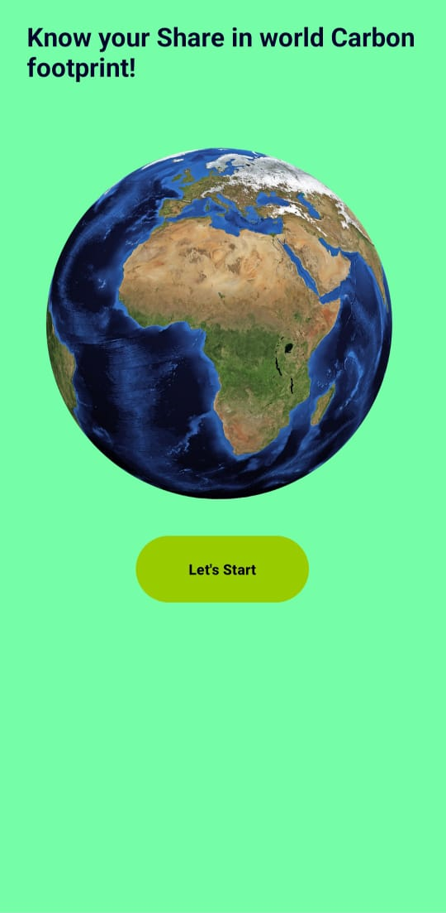

### Register
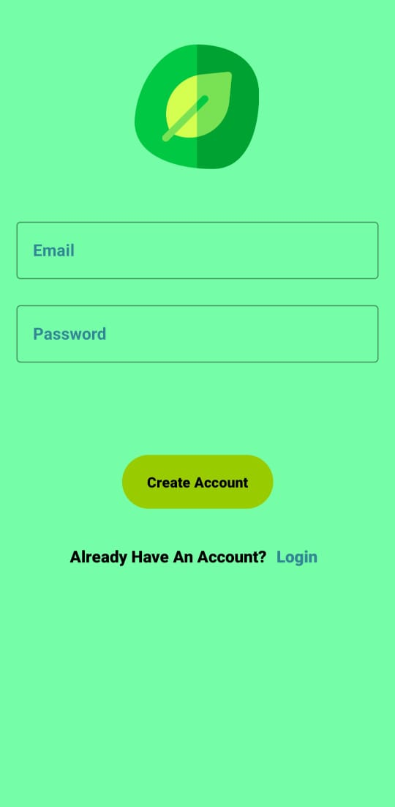

### Login
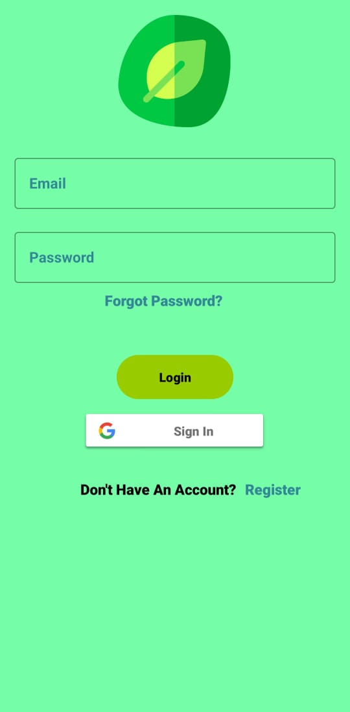

### Name Activity
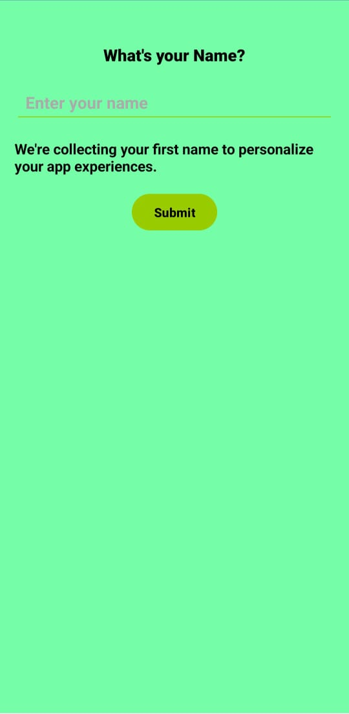

### Dashboard 1
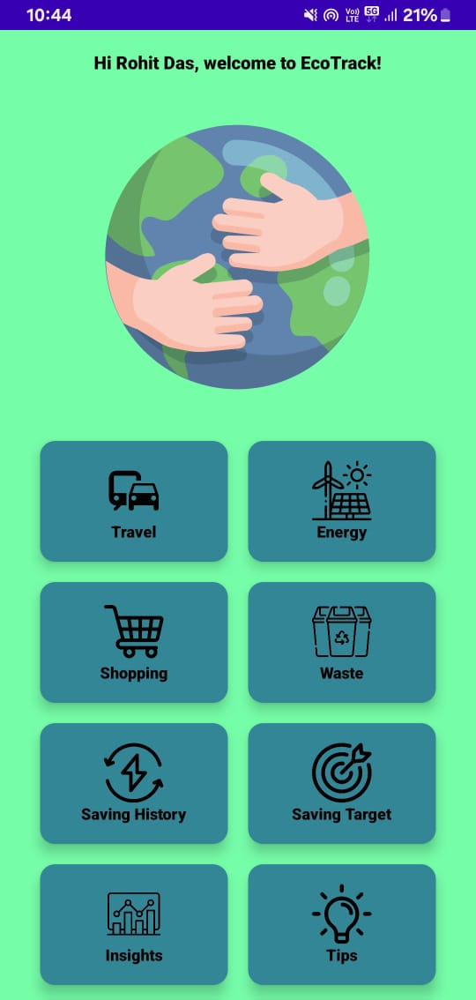

### Dashboard 2
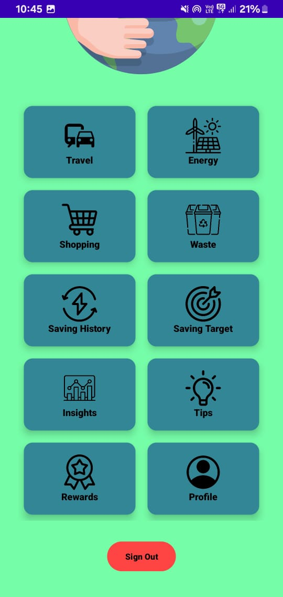

### Travel
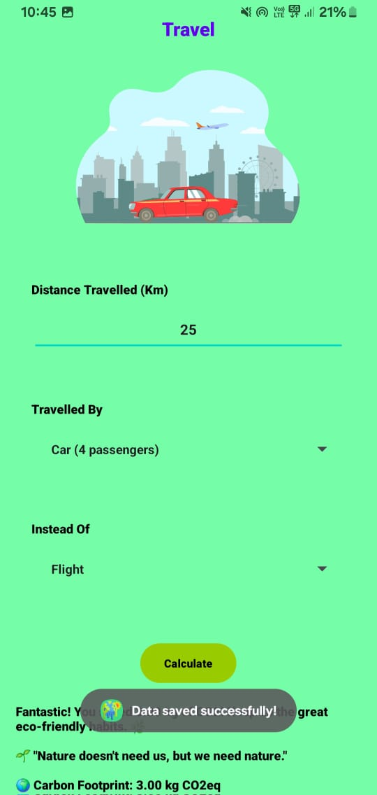

### Energy
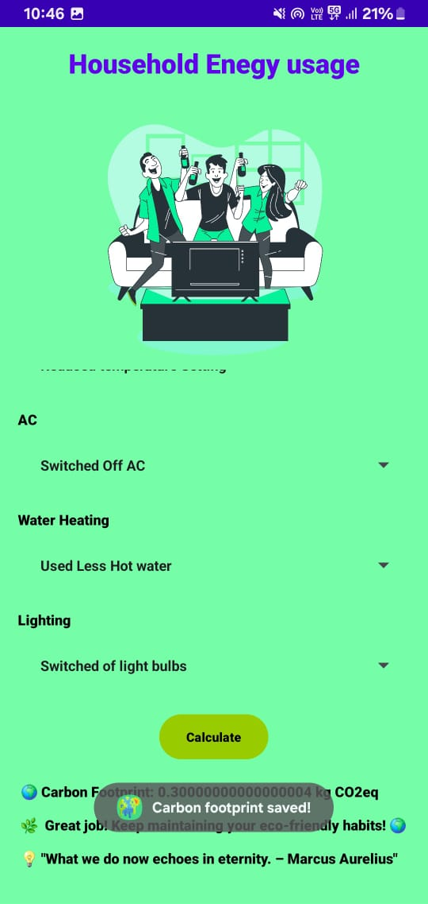

### Waste
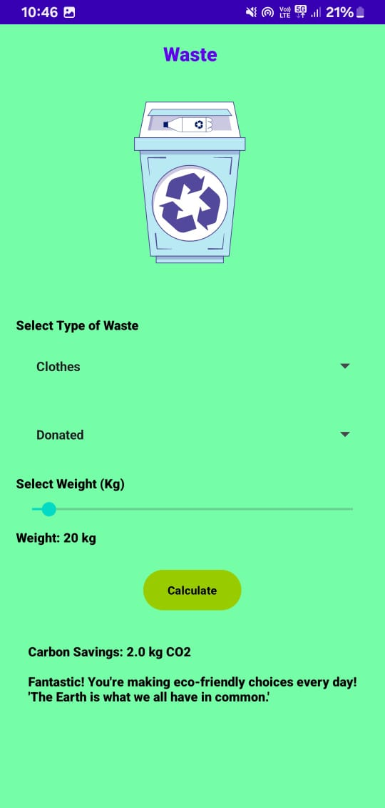

### Shopping
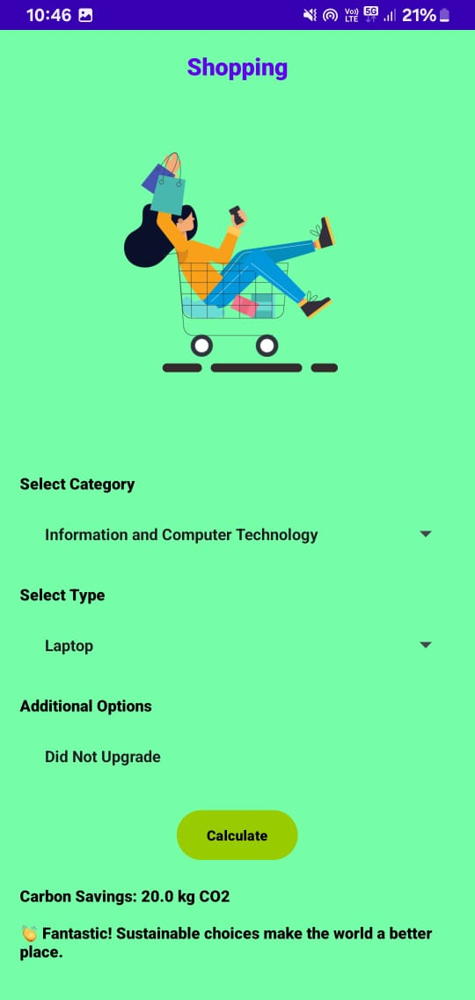

### Saving History
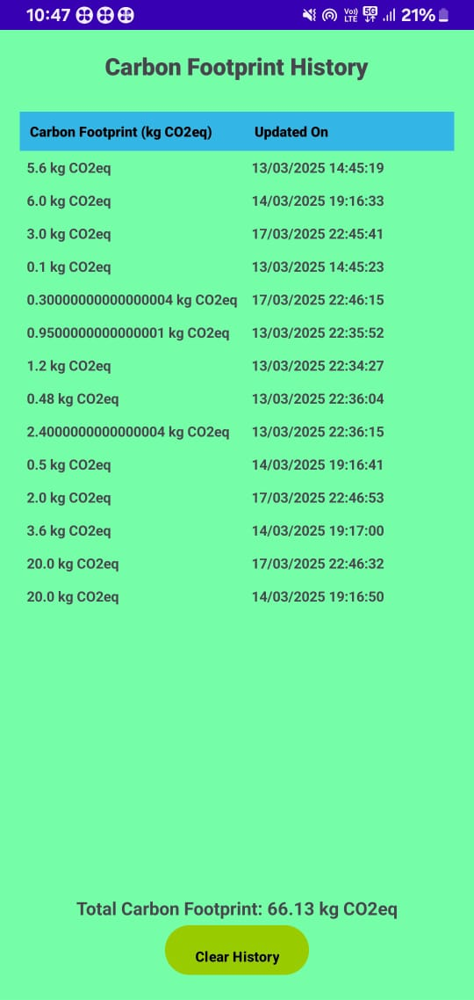

### Saving Target
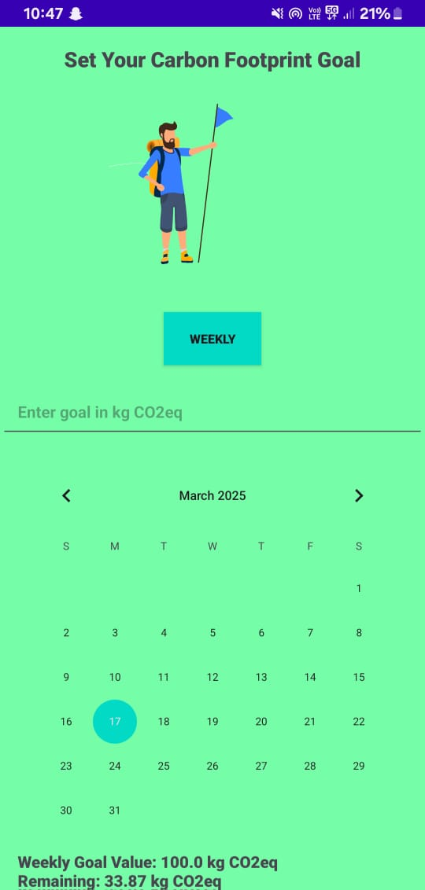

### Weekly
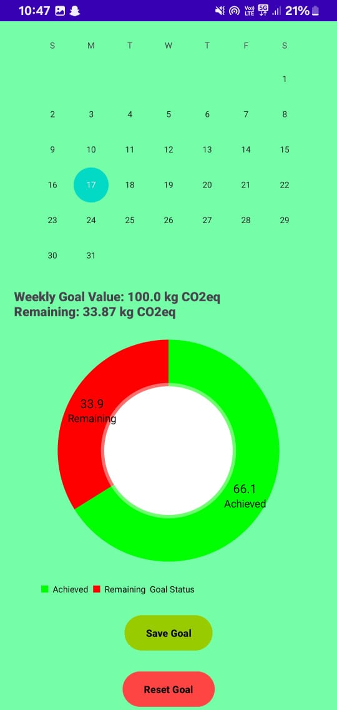

### Monthly
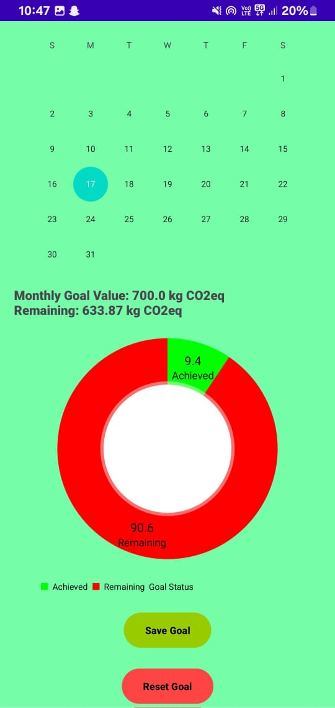

### Insights
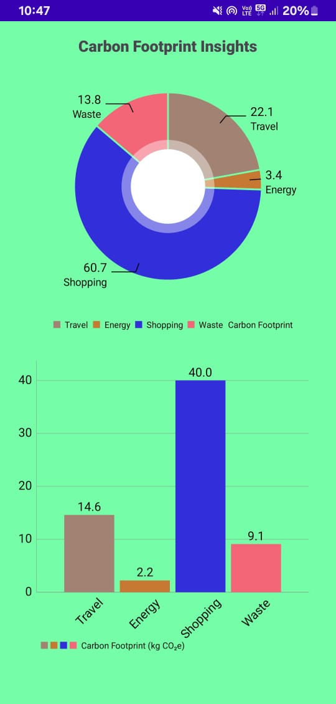

### Tips
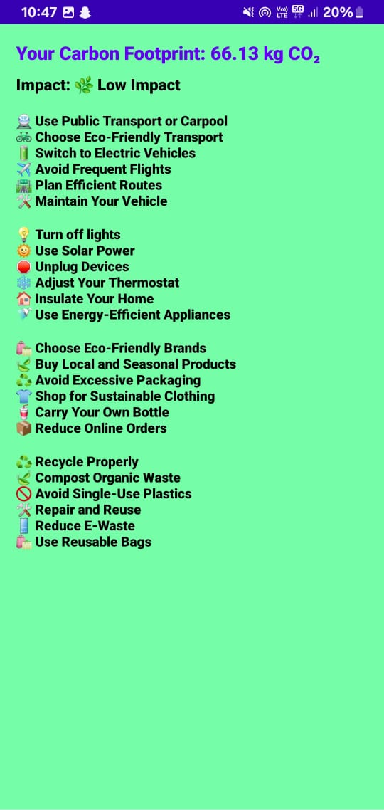


## License
This project is licensed under the MIT License.


